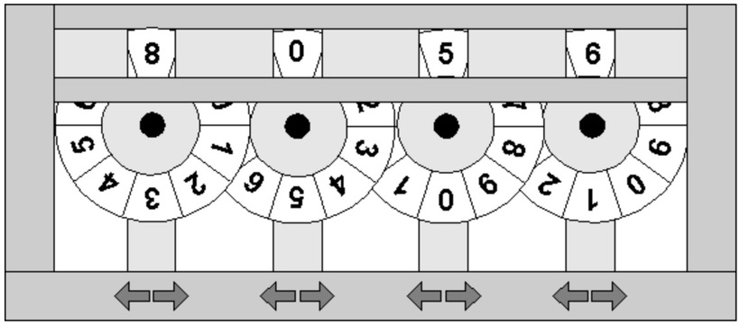

In this problem we will be considering a game played with four wheels. Digits ranging from 0 to 9 are printed consecutively (clockwise) on the periphery of each wheel. The topmost digits of the wheels form a four-digit integer. For example, in the following figure the wheels form the integer 8056. Each wheel has two buttons associated with it. Pressing the button marked with a left arrow rotates the wheel one digit in the clockwise direction and pressing the one marked with the right arrow rotates it by one digit in the opposite direction. Each wheel operates independently of the others (i.e. if the first goes from 9 back around to 0, the second wheel is not affected.)

The game starts with an initial configuration of the wheels. Say, in the initial configuration the topmost digits form the integer S1S2S3S4. You will be given some (say, n) forbidden configurations Fi1Fi2Fi3Fi4 (1<=i<=n) and a target configuration T1T2T3T4. Your job will be to write a program that can calculate the minimum number of button presses required to transform the initial configuration to the target configuration by never passing through a forbidden one.

<h2>Input Format</h2>

Each line of the input contains a 4 digit integer. The first line of each test case specifies the initial configuration of the wheels. The next line contains the target configuration. Each of the remaining lines contains a forbidden configuration.

<h2>Output Format</h2>

For each test case in the input print a line containing the minimum number of button presses required to transform the initial configuration into the target configuration. If the initial configuration is forbidden or the target configuration cannot be reached without passing through a forbidden configuration then print -1.

<h3>Sample Input 0</h3>
1335

2244

3456

4567

<h3>Sample Output 0</h3>
4

<h3>Sample Input 1</h3>
1234

1236

1236

<h3>Sample Output 1</h3>
-1
